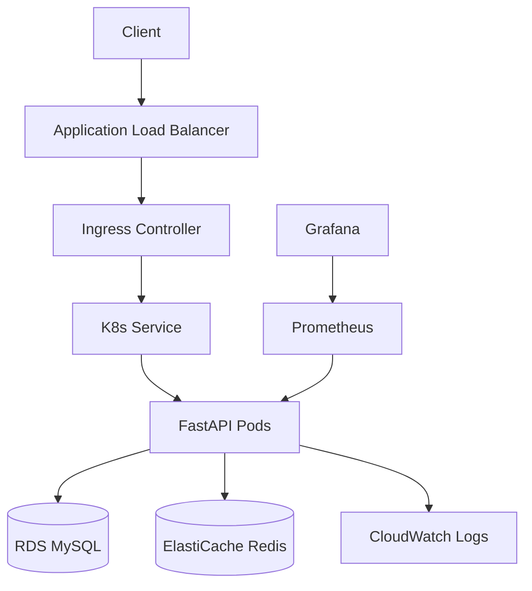

# Cloud Native Expense Tracker

A scalable, cloud-native expense tracking application built with Python (FastAPI), deployed on AWS EKS using Terraform and Helm.

## Overview

This project demonstrates a production-ready cloud infrastructure setup including:
- **Infrastructure as Code**: Terraform for VPC, EKS, RDS, ElastiCache, and more.
- **Containerization**: Dockerized Python application.
- **Orchestration**: Kubernetes (EKS) deployment via Helm charts.
- **CI/CD**: GitHub Actions for automated testing, security scanning, and deployment.
- **Observability**: Prometheus and Grafana for monitoring, Fluent Bit and CloudWatch for logging.

## Architecture



## Prerequisites

- AWS Account and CLI configured
- Terraform >= 1.5.0
- kubectl >= 1.27
- Helm >= 3.0
- Docker

## Quick Start

1. **Bootstrap Infrastructure**:
   ```bash
   cd terraform/bootstrap
   terraform init
   terraform apply
   ```

2. **Deploy Dev Environment**:
   ```bash
   cd terraform/environments/dev
   terraform init
   terraform apply
   ```

3. **Configure kubectl**:
   ```bash
   aws eks update-kubeconfig --name expense-tracker-dev --region us-east-1
   ```

4. **Deploy Application**:
   ```bash
   helm upgrade --install expense-tracker ./helm --values ./helm/values.yaml
   ```

## Documentation

- [Deployment Guide](docs/DEPLOYMENT.md)
- [Operations Runbook](docs/OPERATIONS.md)
- [Architecture Details](docs/ARCHITECTURE.md)
- [Cost Analysis](docs/COST.md)
- [API Reference](docs/API.md)
