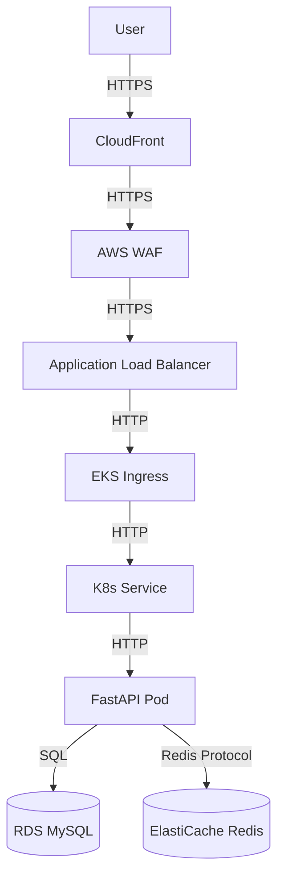

# Architecture Documentation

This document describes the architecture of the Cloud Native Expense Tracker.

## High-Level Architecture

The application follows a microservices-ready architecture deployed on Kubernetes.

## Network Architecture

### VPC Design
- **Region**: us-east-1
- **CIDR**: 10.0.0.0/16 (Dev), 10.1.0.0/16 (Staging), 10.2.0.0/16 (Prod)
- **Availability Zones**: 3 AZs for high availability.

### Subnets
- **Public Subnets**: Host ALB, NAT Gateways, and Bastion Host.
- **Private Subnets**: Host EKS Worker Nodes.
- **Database Subnets**: Host RDS and ElastiCache instances (isolated).

## Security Architecture

### IAM
- **IRSA (IAM Roles for Service Accounts)**: Used for pods to access AWS services (e.g., S3, CloudWatch) securely without long-term credentials.
- **Least Privilege**: Roles are scoped to specific resources and actions.

### Network Security
- **Security Groups**: Strict ingress/egress rules.
  - RDS accepts traffic only from EKS nodes on port 3306.
  - Redis accepts traffic only from EKS nodes on port 6379.
  - EKS nodes accept traffic only from ALB on port 8080.
- **WAF**: Protects against common web exploits (SQLi, XSS).

### Data Security
- **Encryption at Rest**: KMS used for EBS, RDS, and S3 encryption.
- **Encryption in Transit**: TLS for all external communication.

## Data Flow

1. **Request**: User sends a request to the API endpoint.
2. **Edge**: CloudFront caches static content (if any) and forwards API requests.
3. **Protection**: WAF filters malicious traffic.
4. **Routing**: ALB routes traffic to the EKS cluster.
5. **Processing**: FastAPI application processes the request.
   - Checks Redis cache for read operations.
   - Queries RDS for write operations or cache misses.
6. **Response**: Data is returned to the user.
